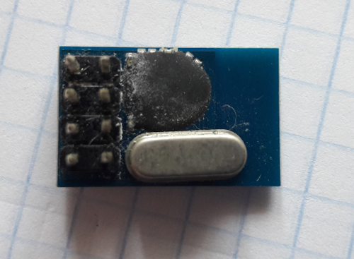

# SE8R01
Arduino library for SE8R01 radio module (nRF24 clone).

# Differences between SE8R01 and nRF24

## Appearance
It is worth noticing that SE8R01 chip requires much less passive elements: just quartz and three capacitors.

Second main difference is that it comes not only in a beautiful QFN package, but it may be put directly
on your PCB board under an epoxy blob.

If you have bought an unknown radio module from Chinese supplier and it has only a few passive components,
it is most likely SE8R01 chip-based module.

## Registers
The main difference between those chip is the fact that SE8R01 has two banks of registers.
What is more, bank 1 registers are not described inside datasheet and the module will not work if you
don't initialize them with some magic numbers.

There are also some registers inside bank 0 with different meaning:

| Register name | Address | Description |
| ------------- |:-------:| ------------|
| SETUP_AW      | 0x03    | 3-byte addresses are not allowed (0b01 combination) |
| SETUP_RETR    | 0x04    | Auto Retransmit Delay is a multiple of 256us, not 250us |
| RF_SETUP      | 0x06    | 6th bit is used as a 3rd bit for setting RF power |
||| 4th bit (PLL_LOCK) is no longer available |
||| Available data rates (RF_DR_HIGH and RF_DR_LOW): <ul><li>the 250kbps mode was removed (0b10)</li><li>new 500kbps mode was introduced (0b11)</li></ul>|
||| RF output power is now 4-bit value (bits: 6,2,1,0) with a new scale: <ul><li>0b1111: +5dBm</li><li>0b1000: 0dBm</li><li>0b0100: -6dBm (matches)</li><li>0b0010: -12dBm (matches)</li><li>0b0001: -18dBm</li></ul>|
| STATUS        | 0x07    | 7th bit indicates currently active register bank: <ul><li>0: Bank 0</li><li>1: Bank 1</li></ul>|
| RPD           | 0x09    | Instead of being a binary carrier detection flag, now it is a 8-bit signed value of estimated in-band signal level in dBm|
| RX_ADDR_P0    | 0x0A    | Different default value: 0x7041882046 |
| RX_ADDR_P1    | 0x0B    | Just 1-byte long (inside nRF24 is 5-bytes long). Default value: 0xC2 |
| TX_ADDR       | 0x10    | Different default value: 0x7041882046 |
| SETUP_VALUE   | 0x1E    | New register. Bits: <ul><li>39:32 - Lna wait counter (in cycles)</li><li>31:24 - Main bandgap wait counter (in us)</li><li>23:16 - Rx timeout counter (in us)</li><li>15:8 - TX_SETUP time, the time between Standby to TX mode (in us)</li><li>7:0 - RX_SETUP time, the time between Standby to RX mode (in us)</li></ul> |
| PRE_GURD      | 0x1F    | New register. Bits: <ul><li>15:8 - Output to analogue</li><li>7:5 - Number of repeat bit after the CRC</li><li>4 - Pre-Guard enable</li><li>3:0 - Number of Pre-Guard bit before preamble (0 corresponds to 1 bit)</li></ul> |

## Magic numbers and Bank 1 registers
All register names and descriptions were borrowed from HS6206 chip datasheet, as they were matching with all SE8R01 example codes found on GitHub.

| Register name | Address | Bits | Default value | Description |
| ------------- |:-------:|:----:|:-------------:|-------------|
| LINE          | 0x00    |      |               |             |
| PLL_CTL0      | 0x01    ||||
| PLL_CTL1      | 0x02    ||||
| CAL_CTL       | 0x03    || 0x2008504050 0x2989554050 ||
| A_CNT_REG     | 0x04    ||||
| B_CNT_REG     | 0x05    ||||
| RESERVED0     | 0x06    ||| Reserved |
| STATUS        | 0x07    ||||
| STATE         | 0x08    ||||
| CHAN          | 0x09    ||||
| IF_FREQ       | 0x0A    || 0x00001E ||
| AFC_COR       | 0x0B    ||||
| FDEV          | 0x0C    || 0x29 ||
| DAC_RANGE     | 0x0D    ||||
| DAC_IN        | 0x0E    ||||
| CTUNING       | 0x0F    ||||
| FTUNING       | 0x10    ||||
| RX_CTRL       | 0x11    || 0x55C209AC ||
| FAGC_CTRL     | 0x12    ||||
| FAGC_CTRL_1   | 0x13    || 0x00140829 ||
| DAC_CAL_LOW   | 0x17    || 0x00 ||
| DAC_CAL_HI    | 0x18    || 0x7F ||
| RESERVED1     | 0x19    ||||
| DOC_DACI      | 0x1A    ||||
| DOC_DACQ      | 0x1B    ||||
| AGC_CTRL      | 0x1C    ||||
| AGC_GAIN      | 0x1D    || 0x02C1EB1C 0x02C1CB1C||
| RF_IVGEN      | 0x1E    || 0x97640081 0x97640001||
| TEST_PKDET    | 0x1F    || 0x2A04007D |||
